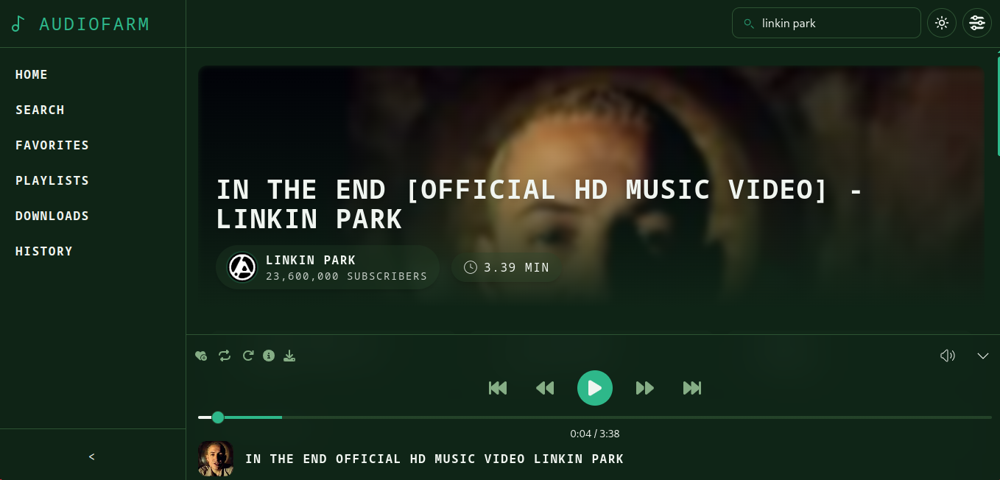

# AudioFarm

AudioFarm is a simple yet powerful music player application that leverages YouTube as its media source. It allows users to stream music and videos, create and manage playlists, save favorite tracks, and download videos for offline access. The app is designed to provide a seamless and organized music experience.

## Overview

AudioFarm is built to simplify music playback and organization. By integrating with YouTube, it offers a vast library of content while providing tools to manage playlists, track listening history, and save music for offline use.

## Key Features

- **Stream Music and Videos**: Play content directly from YouTube.
- **Offline Playback**: Download videos for offline access.
- **Custom Playlists**: Create and manage personalized playlists.
- **Favorites Management**: Save and organize your favorite tracks.
- **Listening History**: Keep track of your recently played content.
- **Multiple Themes**: Customize the app's appearance with different themes.
- **Custom Feeds**: Personalize your experience with tailored content feeds.
- **Export Options**: Export playlists, favorites, and history for backup or sharing.

## Author

Developed by [sidmaz666](https://github.com/sidmaz666) on GitHub.

## Acknowledgements

- [YouTube](https://www.youtube.com) for providing the media source.
- [yt-search](https://www.npmjs.com/package/yt-search) for enabling YouTube search functionality.
- [@distube/ytdl-core](https://www.npmjs.com/package/@distube/ytdl-core) for handling video streaming and downloads.
- [Express](https://expressjs.com) for the backend framework.
- [Peachy](https://github.com/sidmaz666/peachy) for the frontend framework.
- All contributors and open-source libraries that made this project possible.
